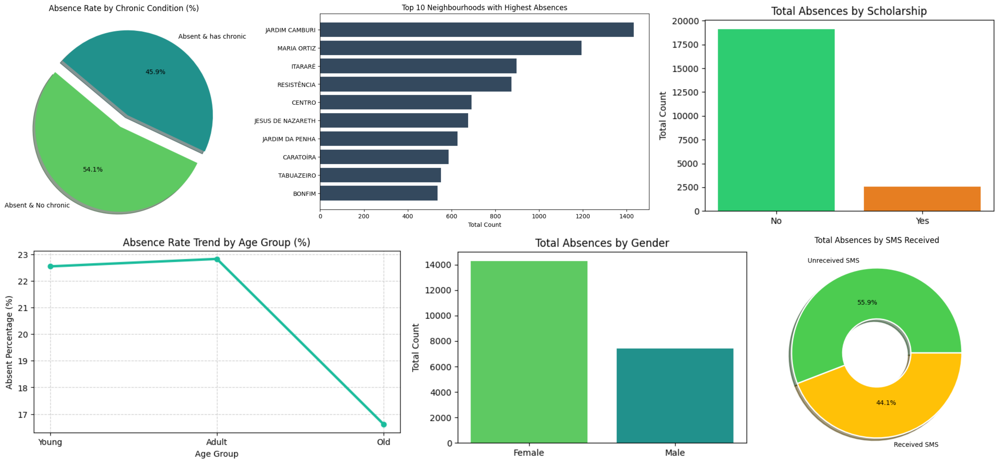

# Investigate Medical Appointments Attendance

A data analysis project built using **Python (Jupyter Notebook)** and core data science libraries (**Pandas**, **NumPy**, and **Matplotlib**) to investigate patient attendance patterns, missed appointments (no-shows), and healthcare compliance factors.

---

## Project Overview
* **Goal:** Uncover data-driven insights to understand key factors influencing patient attendance and help healthcare providers minimize missed appointments.
* **Key Focus Areas:** Analyzing patient demographics (age, gender, and neighborhood), evaluating medical history and chronic conditions, and measuring the direct impact of SMS reminders and scholarship programs on attendance.

---

## Workflow & Steps

### 1. Data Inspection
* Loaded and inspected the medical appointment dataset (`..\RawData\KaggleV2-May-2016.csv`) consisting of **110,527 rows** and **14 columns**.
* Checked for missing values (none found) and duplicated values (none found), and analyzed statistical distributions across patient attributes.
* Discovered invalid entries such as patients with an age of 0 or negative values (3,540 rows), which required cleaning.

### 2. Data Wrangling
* **Memory Optimization:** Converted categorical and binary columns (`Gender`, `Neighbourhood`, `Scholarship`, `Hipertension`, `Diabetes`, `Alcoholism`, `Handcap`, `SMS_received`) to categorical data types, and optimized numeric types (`Age`, `Absent`), successfully reducing memory usage from 11.8 MB to 6.0 MB.
* **Data Cleaning:** Removed rows with invalid ages (<= 0), properly parsed datetime objects for `ScheduledDay` and `AppointmentDay` (removing UTC timezone), and mapped variables for clarity.

### 3. Exploratory Data Analysis (EDA)
* Analyzed patient attendance patterns across multiple research questions, investigating gender differences, top neighborhoods with missed appointments, and scholarship program enrollment.
* Investigated behavioral impacts of SMS reminders, engineered a `Has_Chronic` feature combining chronic flags, and categorized patients into `Age_Group` segments (`Young`, `Adult`, `Old`) to evaluate appointment compliance].

### 4. Data Visualizations & Insights
* Generated data summaries and metrics tracking absentee totals by gender, high no-show neighborhoods, and comparative attendance percentages across chronic conditions and age brackets.

### Patient Attendance & No-Show Analytics
*Analysis of patient demographics, neighborhood trends, and behavioral factors—including chronic conditions, age, scholarship status, and SMS reminders—to help healthcare providers minimize missed appointments.*

